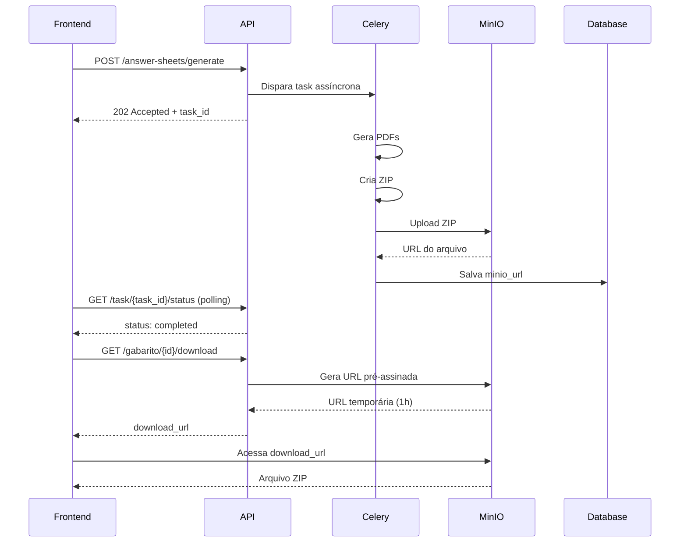
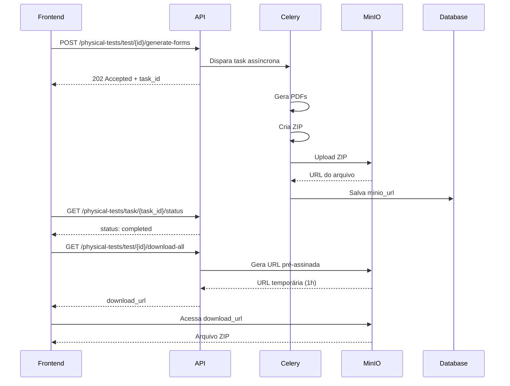

# 📦 **GUIA: MinIO Storage - Armazenamento de Arquivos**

## 🎯 **Objetivo**

Este guia explica como o sistema usa **MinIO** para armazenar arquivos gerados (PDFs, imagens, logos, etc.) de forma escalável e eficiente.

---

## 🏗️ **Arquitetura**

```
┌─────────────────────────────────────────────────────────────┐
│                   CONTAINERS (VPS/Prod)                     │
└─────────────────────────────────────────────────────────────┘

┌──────────────┐   ┌──────────────┐   ┌──────────────┐
│   Flask API  │   │    Celery    │   │   MinIO      │
│ Port 5000    │   │    Worker    │   │ Port 9000/01 │
└──────────────┘   └──────────────┘   └──────────────┘
       │                  │                    │
       └──────────────────┴────────────────────┘
                         │
                  Network: prod/dev/local
```

---

## 📁 **Estrutura de Buckets**

MinIO organiza arquivos em **buckets** (similar a pastas raiz):

```
MinIO Storage:
│
├── answer-sheets/              # Cartões de resposta
│   └── gabaritos/
│       └── {gabarito_id}/
│           └── cartoes.zip
│
├── physical-tests/             # Provas físicas
│   └── {test_id}/
│       └── all_forms.zip
│
├── municipality-logos/         # Logos de municípios
│   └── {city_id}.png
│
├── school-logos/               # Logos de escolas
│   └── {school_id}.png
│
├── question-images/            # Imagens de questões
│   └── {question_id}/
│       └── image_1.png
│
└── user-uploads/               # Uploads diversos
    ├── avatars/
    └── documents/
```

---

## 🔧 **Como Funciona**

### **1. Geração de Cartões de Resposta**



### **2. Geração de Provas Físicas**



---

## 🔐 **URLs Pré-assinadas**

As **URLs pré-assinadas** permitem download direto do MinIO sem passar pela API:

### **Vantagens:**
✅ **Performance**: Download direto do storage, não consome recursos da API  
✅ **Segurança**: URL expira após 1 hora  
✅ **Escalabilidade**: MinIO serve milhares de downloads simultaneamente  

### **Exemplo de URL:**
```
http://minio-server:9000/answer-sheets/gabaritos/abc-123/cartoes.zip?
X-Amz-Algorithm=AWS4-HMAC-SHA256&
X-Amz-Credential=minioadmin%2F20260123%2Fus-east-1%2Fs3%2Faws4_request&
X-Amz-Date=20260123T120000Z&
X-Amz-Expires=3600&
X-Amz-SignedHeaders=host&
X-Amz-Signature=abc123...
```

⏱️ **Validade**: 1 hora (3600 segundos)

---

## 📡 **API Endpoints (Frontend)**

### **1. Download de Cartões de Resposta**

```http
GET /answer-sheets/gabarito/{gabarito_id}/download
Authorization: Bearer {token}
```

**Resposta (200 OK):**
```json
{
  "download_url": "http://minio:9000/answer-sheets/...",
  "expires_in": "1 hour",
  "gabarito_id": "abc-123",
  "test_id": "test-456",
  "class_id": "class-789",
  "class_name": "9º Ano A",
  "title": "Avaliação de Matemática",
  "num_questions": 20,
  "generated_at": "2026-01-23T10:30:00",
  "created_at": "2026-01-23T09:00:00",
  "minio_url": "http://minio:9000/answer-sheets/gabaritos/abc-123/cartoes.zip"
}
```

**Erro (400 - Não gerado ainda):**
```json
{
  "error": "ZIP de cartões ainda não foi gerado",
  "message": "Use a rota POST /answer-sheets/generate...",
  "gabarito_id": "abc-123",
  "status": "not_generated"
}
```

---

### **2. Download de Provas Físicas**

```http
GET /physical-tests/test/{test_id}/download-all
Authorization: Bearer {token}
```

**Resposta (200 OK):**
```json
{
  "download_url": "http://minio:9000/physical-tests/...",
  "expires_in": "1 hour",
  "test_id": "test-456",
  "test_title": "Prova de Geografia",
  "gabarito_id": "gab-789",
  "generated_at": "2026-01-23T11:00:00",
  "minio_url": "http://minio:9000/physical-tests/test-456/all_forms.zip"
}
```

---

## 💻 **Implementação Frontend**

### **React/Vue.js - Download de Cartões**

```javascript
async function downloadAnswerSheets(gabaritoId) {
  try {
    // 1. Solicitar URL de download
    const response = await fetch(
      `/answer-sheets/gabarito/${gabaritoId}/download`,
      {
        headers: {
          'Authorization': `Bearer ${token}`
        }
      }
    );
    
    if (!response.ok) {
      const error = await response.json();
      
      if (error.status === 'not_generated') {
        alert('Os cartões ainda não foram gerados. Gere primeiro.');
        return;
      }
      
      throw new Error(error.error);
    }
    
    const data = await response.json();
    
    // 2. Redirecionar para URL pré-assinada (download direto do MinIO)
    window.location.href = data.download_url;
    
    // Ou abrir em nova aba:
    // window.open(data.download_url, '_blank');
    
    console.log(`Download expira em: ${data.expires_in}`);
    
  } catch (error) {
    console.error('Erro ao baixar cartões:', error);
    alert('Erro ao gerar link de download');
  }
}
```

### **React/Vue.js - Download de Provas Físicas**

```javascript
async function downloadPhysicalTests(testId) {
  try {
    const response = await fetch(
      `/physical-tests/test/${testId}/download-all`,
      {
        headers: {
          'Authorization': `Bearer ${token}`
        }
      }
    );
    
    if (!response.ok) {
      const error = await response.json();
      
      if (error.status === 'not_generated') {
        alert('As provas ainda não foram geradas.');
        return;
      }
      
      throw new Error(error.error);
    }
    
    const data = await response.json();
    
    // Download direto do MinIO
    window.location.href = data.download_url;
    
  } catch (error) {
    console.error('Erro ao baixar provas:', error);
  }
}
```

---

## ⚙️ **Variáveis de Ambiente**

Configure no GitLab CI/CD (Settings > CI/CD > Variables):

```bash
# MinIO Server
MINIO_ROOT_USER=minioadmin
MINIO_ROOT_PASSWORD=SenhaSuperForte123!  # ⚠️ Produção: use senha forte!
MINIO_ENDPOINT=minio-server:9000         # Nome do container na rede Docker
MINIO_ACCESS_KEY=minioadmin
MINIO_SECRET_KEY=SenhaSuperForte123!     # ⚠️ Produção: use senha forte!
MINIO_SECURE=false                       # false para HTTP, true para HTTPS

# Opcional: URL pública (se usar proxy/nginx)
MINIO_ENDPOINT_PUBLIC=https://storage.seudominio.com
```

---

## 🗄️ **Banco de Dados (Novos Campos)**

### **AnswerSheetGabarito**
```python
class AnswerSheetGabarito(db.Model):
    # ... campos existentes ...
    
    # ✅ NOVOS CAMPOS MinIO
    minio_url = db.Column(db.String(500))           # URL completa do ZIP
    minio_object_name = db.Column(db.String(200))   # Path no bucket
    minio_bucket = db.Column(db.String(100))        # Nome do bucket
    zip_generated_at = db.Column(db.DateTime)       # Timestamp geração
```

### **PhysicalTestForm**
```python
class PhysicalTestForm(db.Model):
    # ... campos existentes ...
    
    # ✅ NOVOS CAMPOS MinIO
    minio_url = db.Column(db.String(500))
    minio_object_name = db.Column(db.String(200))
    minio_bucket = db.Column(db.String(100))
```

---

## 🚀 **Console Web do MinIO**

Acesse a interface visual do MinIO:

```
URL: http://seu-servidor:9001
User: minioadmin
Pass: (conforme MINIO_ROOT_PASSWORD)
```

**Funcionalidades:**
- 📁 Navegar buckets e arquivos
- 📊 Ver estatísticas de uso
- 🔐 Gerenciar permissões
- 🗑️ Deletar arquivos manualmente

---

## 🔍 **Troubleshooting**

### **Erro: "ZIP ainda não foi gerado"**
**Causa**: A task Celery ainda está processando ou falhou.  
**Solução**: Verifique o status da task via polling.

### **Erro: "Erro ao gerar URL de download"**
**Causa**: MinIO não está acessível ou objeto não existe.  
**Solução**: 
1. Verifique se MinIO container está rodando: `docker ps | grep minio`
2. Verifique logs: `docker logs minio-server`
3. Verifique se bucket existe no console web

### **Download expira antes de terminar**
**Causa**: URL pré-assinada expira em 1 hora.  
**Solução**: Solicite nova URL via API.

---

## 📊 **Monitoramento**

### **Verificar uso de espaço:**
```bash
docker exec minio-server du -sh /data
```

### **Listar arquivos em um bucket:**
```bash
docker run --rm --network prod \
  minio/mc:latest \
  sh -c "mc alias set myminio http://minio-server:9000 minioadmin minioadmin123 && \
         mc ls myminio/answer-sheets"
```

---

## ✅ **Checklist de Migração**

- [x] MinIO configurado no GitLab CI
- [x] Buckets criados automaticamente
- [x] MinIOService implementado
- [x] Tasks Celery atualizadas (upload para MinIO)
- [x] Rotas de download atualizadas (URLs pré-assinadas)
- [x] Migração do banco executada
- [x] Frontend atualizado para usar novas rotas

---

## 🎓 **Exemplos de Uso**

### **Upload de Logo de Município (Futuro)**
```python
from app.services.storage.minio_service import MinIOService

minio = MinIOService()

# Upload
result = minio.upload_municipality_logo(
    city_id='city-123',
    image_data=logo_bytes,
    extension='png'
)

# Resultado
# {
#   'url': 'http://minio:9000/municipality-logos/city-123.png',
#   'object_name': 'city-123.png',
#   'bucket': 'municipality-logos',
#   'size': 15234
# }
```

### **Upload de Imagem de Questão (Futuro)**
```python
result = minio.upload_question_image(
    question_id='question-456',
    image_data=image_bytes,
    image_name='diagram_1.png'
)
```

---

## 📚 **Referências**

- [MinIO Documentation](https://min.io/docs/minio/linux/index.html)
- [MinIO Python SDK](https://min.io/docs/minio/linux/developers/python/minio-py.html)
- [S3 API Compatibility](https://docs.aws.amazon.com/AmazonS3/latest/API/Welcome.html)

---

**Última atualização**: 2026-01-23  
**Versão**: 1.0.0
