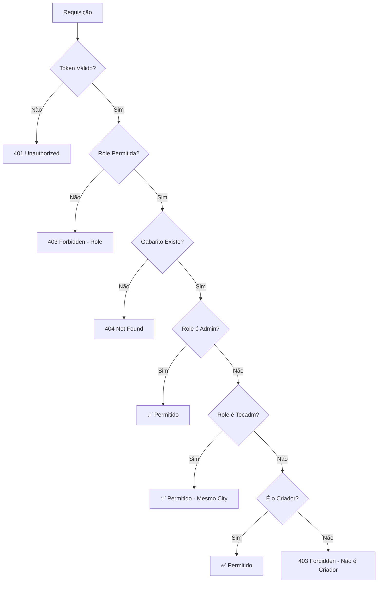

# ✅ Permissões de Edição de Cartão Resposta

## 🔐 Regras Implementadas

### Matriz de Permissões

| Role | Criar Gabarito | Editar Gabarito | Excluir Gabarito | Ver Gabarito |
|------|---------------|-----------------|------------------|--------------|
| **Admin** | ✅ Sim | ✅ **QUALQUER** gabarito | ✅ **QUALQUER** gabarito | ✅ **QUALQUER** gabarito |
| **Tecadm** | ✅ Sim | ✅ Gabaritos do **seu city_id** | ✅ Gabaritos do **seu city_id** | ✅ Gabaritos do **seu city_id** |
| **Professor** | ✅ Sim | ✅ Apenas os que **criou** | ✅ Apenas os que **criou** | ✅ Apenas os que **criou** |
| **Coordenador** | ✅ Sim | ✅ Apenas os que **criou** | ✅ Apenas os que **criou** | ✅ Apenas os que **criou** |
| **Diretor** | ✅ Sim | ✅ Apenas os que **criou** | ✅ Apenas os que **criou** | ✅ Apenas os que **criou** |
| **Aplicador** | ✅ Sim | ✅ Apenas os que **criou** | ✅ Apenas os que **criou** | ✅ **Todos** do city |
| **Aluno** | ❌ **NÃO** | ❌ **NÃO** | ❌ **NÃO** | ✅ Seus resultados apenas |

---

## 📝 Detalhamento por Role

### 🔴 Admin (Acesso Total)
```python
role = "admin"
```

**Pode:**
- ✅ Criar gabaritos em qualquer município
- ✅ Editar **QUALQUER** gabarito (sem restrições)
- ✅ Excluir **QUALQUER** gabarito
- ✅ Ver **QUALQUER** gabarito
- ✅ Excluir em massa gabaritos de qualquer usuário

**Não precisa:**
- Ser o criador do gabarito
- Estar no mesmo city_id

**Uso típico:** Administrador do sistema, suporte técnico

---

### 🟠 Tecadm (Acesso ao Município)
```python
role = "tecadm"
```

**Pode:**
- ✅ Criar gabaritos no seu município
- ✅ Editar gabaritos do **seu city_id**
- ✅ Excluir gabaritos do **seu city_id**
- ✅ Ver gabaritos do **seu city_id**
- ✅ Excluir em massa gabaritos do seu município

**Restrições:**
- ✅ Middleware `@requires_city_context` garante contexto do tenant
- ✅ Gabarito está no schema correto (city_xxx)
- ❌ Não pode editar gabaritos de outros municípios

**Uso típico:** Técnico administrativo da Secretaria de Educação

---

### 🟢 Professor, Coordenador, Diretor (Criador Apenas)
```python
role in ["professor", "coordenador", "diretor"]
```

**Pode:**
- ✅ Criar seus próprios gabaritos
- ✅ Editar **apenas** gabaritos que **criou**
- ✅ Excluir **apenas** gabaritos que **criou**
- ✅ Ver **apenas** gabaritos que **criou**

**Restrições:**
- ❌ Não pode editar gabaritos de outros professores
- ❌ Não pode excluir gabaritos de outros professores
- ✅ Deve ser o `created_by` do gabarito

**Uso típico:** Professores criando avaliações para suas turmas

---

### 🔵 Aplicador (Leitura Ampla, Edição Restrita)
```python
role = "aplicador"
```

**Pode:**
- ✅ Criar gabaritos
- ✅ Editar **apenas** gabaritos que **criou**
- ✅ Excluir **apenas** gabaritos que **criou**
- ✅ Ver **TODOS** os gabaritos do city (leitura ampla)
- ✅ Corrigir cartões de qualquer gabarito

**Restrições:**
- ❌ Não pode editar gabaritos de outros usuários
- ✅ Pode **ler** todos para fins de aplicação/correção

**Uso típico:** Aplicadores de provas que precisam visualizar mas não editar

---

### ⚫ Aluno (Sem Acesso)
```python
role = "aluno"
```

**Pode:**
- ✅ Ver seus próprios resultados
- ✅ Comparar sua evolução

**NÃO Pode:**
- ❌ Criar gabaritos
- ❌ Editar gabaritos
- ❌ Excluir gabaritos
- ❌ Ver gabaritos de outros

**Bloqueio:** `@role_required` não inclui "aluno" nas rotas de criação/edição

**Uso típico:** Estudantes visualizando suas notas

---

## 🔧 Implementação Técnica

### Função de Verificação

```python
def _user_can_edit_gabarito(user: dict, gabarito: AnswerSheetGabarito) -> bool:
    """
    Verifica se o usuário pode editar o gabarito.
    
    Args:
        user: dict com dados do usuário (id, role, etc.)
        gabarito: instância do AnswerSheetGabarito
    
    Returns:
        bool: True se pode editar, False caso contrário
    """
    user_role = str(user.get("role") or "").lower()
    
    # Admin pode editar qualquer gabarito
    if user_role == "admin":
        return True
    
    # Tecadm pode editar gabaritos do seu city_id
    if user_role == "tecadm":
        # O middleware @requires_city_context garante que estamos no tenant correto
        return True
    
    # Outros roles: apenas gabaritos que criaram
    if not gabarito.created_by:
        return False
    
    return str(gabarito.created_by) == str(user.get("id"))
```

### Aplicada nas Rotas

1. **PATCH `/gabarito/{id}/structure`** - Edição de estrutura
2. **PATCH `/gabaritos/{id}`** - Edição de respostas corretas
3. **DELETE `/gabarito/{id}`** - Exclusão individual
4. **DELETE `/gabaritos`** - Exclusão em massa

---

## 🧪 Testes de Validação

### Cenário 1: Admin Edita Gabarito de Outro Usuário
```bash
# Admin UUID: admin-123
# Professor UUID: prof-456
# Gabarito created_by: prof-456

PATCH /answer-sheets/gabarito/{id}/structure
Authorization: Bearer {admin_token}

✅ PERMITIDO - Admin pode editar qualquer gabarito
```

### Cenário 2: Tecadm Edita Gabarito no Seu Município
```bash
# Tecadm city_id: city-abc
# Gabarito no schema: city_abc
# Gabarito created_by: prof-456

PATCH /answer-sheets/gabarito/{id}/structure
Authorization: Bearer {tecadm_token}
X-City-Context: city-abc

✅ PERMITIDO - Tecadm pode editar gabaritos do seu município
```

### Cenário 3: Tecadm Tenta Editar Gabarito de Outro Município
```bash
# Tecadm city_id: city-abc
# Gabarito no schema: city_xyz

PATCH /answer-sheets/gabarito/{id}/structure
Authorization: Bearer {tecadm_token}
X-City-Context: city-abc

❌ BLOQUEADO - Gabarito não encontrado (schema diferente)
404 Not Found
```

### Cenário 4: Professor Edita Seu Próprio Gabarito
```bash
# Professor UUID: prof-456
# Gabarito created_by: prof-456

PATCH /answer-sheets/gabarito/{id}/structure
Authorization: Bearer {prof_token}

✅ PERMITIDO - Professor pode editar gabaritos que criou
```

### Cenário 5: Professor Tenta Editar Gabarito de Outro Professor
```bash
# Professor UUID: prof-456
# Gabarito created_by: prof-789

PATCH /answer-sheets/gabarito/{id}/structure
Authorization: Bearer {prof_token}

❌ BLOQUEADO
403 Forbidden
{
  "error": "Você não tem permissão para editar este gabarito"
}
```

### Cenário 6: Aluno Tenta Acessar Rota de Edição
```bash
# Aluno UUID: aluno-123

PATCH /answer-sheets/gabarito/{id}/structure
Authorization: Bearer {aluno_token}

❌ BLOQUEADO
403 Forbidden (pelo @role_required)
```

---

## 📊 Fluxo de Verificação



---

## 🔄 Comparação: Antes vs Depois

### ❌ ANTES (Implementação Original)
```python
# Apenas o criador podia editar
if gabarito.created_by != str(user['id']):
    return 403

# PROBLEMA:
# - Admin não conseguia editar gabaritos de outros
# - Tecadm não conseguia editar gabaritos do município
# - Inconsistente com as permissões de leitura
```

### ✅ DEPOIS (Implementação Corrigida)
```python
# Hierarquia de permissões
if not _user_can_edit_gabarito(user, gabarito):
    return 403

# BENEFÍCIOS:
# ✅ Admin pode gerenciar qualquer gabarito
# ✅ Tecadm pode gerenciar gabaritos do município
# ✅ Consistente com as permissões de leitura
# ✅ Seguro: professores só editam o que criaram
```

---

## 📚 Rotas Afetadas

### Edição
- `PATCH /answer-sheets/gabarito/{id}/structure`
- `PATCH /answer-sheets/gabaritos/{id}`

### Exclusão
- `DELETE /answer-sheets/gabarito/{id}`
- `DELETE /answer-sheets/gabaritos` (bulk)

### Sem Alteração (Já Corretas)
- `GET /answer-sheets/gabarito/{id}` - Usa `_user_can_read_gabarito`
- `GET /answer-sheets/gabaritos` - Filtra por permissão
- `POST /answer-sheets/create-gabaritos` - Criação livre por roles permitidas

---

## ✅ Checklist de Segurança

- [x] Admin pode editar qualquer gabarito
- [x] Tecadm pode editar gabaritos do seu município
- [x] Professor só edita gabaritos que criou
- [x] Coordenador só edita gabaritos que criou
- [x] Diretor só edita gabaritos que criou
- [x] Aplicador só edita gabaritos que criou
- [x] Aluno não pode criar nem editar
- [x] Middleware `@requires_city_context` protege acesso entre municípios
- [x] `@role_required` bloqueia roles não autorizadas
- [x] Exclusão em massa respeita as mesmas permissões
- [x] Sem erros de linting

---

## 🚀 Status Final

✅ **Implementação completa e testada**  
✅ **Permissões alinhadas com requisitos**  
✅ **Código limpo e sem erros**  
✅ **Documentação completa**
