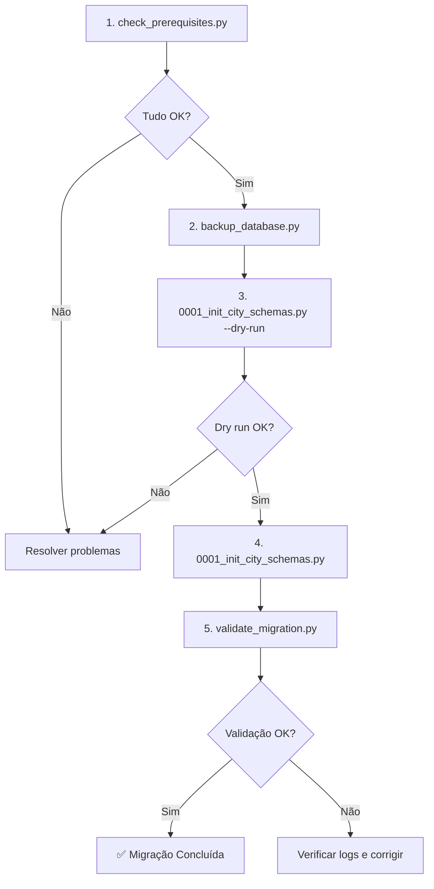

# 📚 Índice de Arquivos - Migração Multi-Tenant

Sistema completo de migração para arquitetura multi-tenant por schema PostgreSQL.

---

## 📁 Estrutura de Arquivos

```
migrations_multitenant/
│
├── 📘 INDEX.md                          # Este arquivo (índice geral)
├── 📖 README.md                         # Documentação completa
├── 🚀 QUICKSTART.md                     # Guia rápido passo a passo
│
├── 🔧 Scripts Principais
│   ├── 0001_init_city_schemas.py       # Script de migração inicial
│   ├── 0003_add_answer_sheet_generations.py  # Histórico de ZIPs por gabarito (city_xxx)
│   ├── validate_migration.py           # Validação pós-migração
│   ├── backup_database.py              # Backup antes de migrar
│   └── check_prerequisites.py          # Verificação de pré-requisitos
│
├── 🗂️ Configuração
│   └── .gitignore                      # Ignora logs e backups
│
└── 📊 Logs (auto-gerado)
    ├── migration_0001_*.log            # Logs de execução
    └── backup_*.dump / backup_*.sql    # Backups do banco
```

---

## 📖 Documentação

### 📘 INDEX.md (Este arquivo)

**Propósito:** Índice navegável de todos os arquivos do projeto  
**Quando usar:** Para entender a estrutura geral do projeto

---

### 📖 README.md

**Propósito:** Documentação técnica completa  
**Conteúdo:**

- Visão geral da arquitetura multi-tenant
- Explicação de schemas PUBLIC vs CITY
- Detalhamento de cada etapa da migração
- Queries SQL para verificação
- Troubleshooting
- Próximos scripts (0002, 0003, 0004)

**Quando usar:**

- Para entender a arquitetura
- Para resolver problemas
- Para referência técnica

**Ler:** Antes de executar qualquer script

---

### 🚀 QUICKSTART.md

**Propósito:** Guia prático passo a passo  
**Conteúdo:**

- Instalação de dependências
- Passo 1: Backup
- Passo 2: Dry Run
- Passo 3: Migração Real
- Passo 4: Validação
- Checklist final

**Quando usar:**

- Primeira vez executando a migração
- Precisa de instruções diretas
- Quer seguir um roteiro claro

**Ler:** Durante a execução da migração

---

## 🔧 Scripts

### ✅ check_prerequisites.py

**Propósito:** Verificar se ambiente está pronto para migração

**O que verifica:**

- ✓ Python 3.7+
- ✓ Dependências instaladas (psycopg2, dotenv)
- ✓ app/.env existe e configurado
- ✓ Conexão com banco de dados
- ✓ Permissões CREATE no PostgreSQL
- ✓ pg_dump instalado
- ✓ Municípios cadastrados
- ✓ Espaço em disco

**Como executar:**

```bash
python migrations_multitenant/check_prerequisites.py
```

**Resultado:**

```
✅ TUDO OK! Pronto para executar migração.

Próximos passos:
  1. python migrations_multitenant/backup_database.py
  2. python migrations_multitenant/0001_init_city_schemas.py --dry-run
  3. python migrations_multitenant/0001_init_city_schemas.py
  4. python migrations_multitenant/validate_migration.py
```

**Quando usar:** SEMPRE antes de começar a migração

---

### 💾 backup_database.py

**Propósito:** Criar backup do banco antes da migração

**O que faz:**

- Cria backup em formato CUSTOM (.dump)
- Cria backup em formato SQL (.sql)
- Opcionalmente cria backup só do schema
- Mostra instruções de restore

**Como executar:**

```bash
# Backup completo (custom + SQL)
python migrations_multitenant/backup_database.py

# Apenas custom
python migrations_multitenant/backup_database.py --format custom

# Apenas SQL
python migrations_multitenant/backup_database.py --format sql

# Apenas schema (estrutura)
python migrations_multitenant/backup_database.py --schema-only
```

**Arquivos gerados:**

- `backup_afirmeplay_dev_YYYYMMDD_HHMMSS.dump`
- `backup_afirmeplay_dev_YYYYMMDD_HHMMSS.sql`

**Quando usar:** SEMPRE antes de executar migração

---

### 🚀 0001_init_city_schemas.py

**Propósito:** Script de migração inicial multi-tenant

**O que faz:**

**Etapa 1:** Criar schemas city\_<city_id>

- Lê municípios de public.city
- Cria schema para cada município
- Adiciona comentários descritivos

**Etapa 2:** Criar tabelas CITY

- Cria 54 tabelas operacionais em cada schema
- Estrutura: school, student, teacher, test, etc
- ⭐ Nova tabela: school_managers

**Etapa 3:** Ajustar public.questions

- Adiciona colunas: scope_type, owner_city_id
- Cria ENUM question_scope_type
- Marca questões existentes como GLOBAL

**Etapa 4:** Migrar school_managers

- Lê manager.school_id
- Cria vínculos em city\_<id>.school_managers
- NÃO remove manager.school_id ainda

**Como executar:**

```bash
# Modo DRY RUN (simulação)
python migrations_multitenant/0001_init_city_schemas.py --dry-run

# Execução REAL (altera banco!)
python migrations_multitenant/0001_init_city_schemas.py
```

**Segurança:**

- ✅ Idempotente (pode rodar várias vezes)
- ✅ NÃO remove tabelas do public
- ✅ NÃO move dados (apenas estrutura)
- ✅ Gera log automático
- ✅ Pede confirmação "CONFIRMO"

**Logs gerados:**

- `migration_0001_YYYYMMDD_HHMMSS.log`

**Quando usar:** Após backup e verificação de pré-requisitos

---

### ✔️ validate_migration.py

**Propósito:** Validar se migração foi executada corretamente

**O que verifica:**

**1️⃣ Schemas CITY**

- Schemas criados para todos os municípios
- Nomenclatura correta (city\_<uuid>)

**2️⃣ Tabelas CITY**

- 54 tabelas esperadas em cada schema
- Tabelas faltando ou extras

**3️⃣ Ajustes em public.question**

- Colunas scope_type, owner_city_id criadas
- ENUM question_scope_type existe
- Questões marcadas como GLOBAL

**4️⃣ school_managers**

- Tabela criada em cada schema
- Vínculos migrados de manager.school_id

**5️⃣ Foreign Keys**

- FKs cross-schema funcionando
- Integridade referencial OK

**6️⃣ Índices**

- Índices de performance criados
- Performance otimizada

**Como executar:**

```bash
python migrations_multitenant/validate_migration.py
```

**Resultado esperado:**

```
✅ MIGRAÇÃO VALIDADA COM SUCESSO!
Todos os componentes foram criados corretamente.
```

**Quando usar:** SEMPRE após executar migração

---

## 🎯 Fluxo de Execução Recomendado



---

## ⚙️ Configuração

### .gitignore

**Propósito:** Evitar commit de arquivos sensíveis

**Ignora:**

- `*.log` (logs de migração)
- `*.sql`, `*.dump` (backups)
- `__pycache__/` (cache Python)
- `venv/`, `env/` (ambientes virtuais)

---

## 🔢 Ordem de Execução (Resumo)

1. **check_prerequisites.py** ← Verificar ambiente
2. **backup_database.py** ← Criar backup
3. **0001_init_city_schemas.py --dry-run** ← Testar (simulação)
4. **0001_init_city_schemas.py** ← Executar (real)
5. **validate_migration.py** ← Validar resultado

---

## 📊 Estatísticas

- **Schemas criados:** 1 por município
- **Tabelas por schema:** 54 tabelas operacionais
- **Tabelas PUBLIC ajustadas:** 1 (question)
- **Novas tabelas:** 1 por schema (school_managers)
- **Total de linhas de código:** ~2.500 linhas Python + SQL
- **Total de documentação:** ~1.500 linhas Markdown

---

## 🆘 Ajuda Rápida

| Problema                 | Arquivo para Consultar            |
| ------------------------ | --------------------------------- |
| Não sei por onde começar | QUICKSTART.md                     |
| Entender arquitetura     | README.md                         |
| Erro no banco            | README.md (seção Troubleshooting) |
| Erro no Python           | check_prerequisites.py            |
| Validação falhou         | validate_migration.py (resumo)    |
| Rollback                 | README.md (seção Backup/Restore)  |

---

## ✅ Checklist Rápido

Antes de executar em PRODUÇÃO:

- [ ] Leu README.md completo
- [ ] Leu QUICKSTART.md
- [ ] Executou check_prerequisites.py
- [ ] Backup criado e guardado
- [ ] Dry run passou sem erros
- [ ] Testado em DEV primeiro
- [ ] Validação passou
- [ ] Plano de rollback pronto
- [ ] Time notificado

---

**Versão:** 1.0  
**Data:** 2026-02-10  
**Autor:** Sistema de Migração Multi-Tenant  
**Status:** ✅ Pronto para uso
